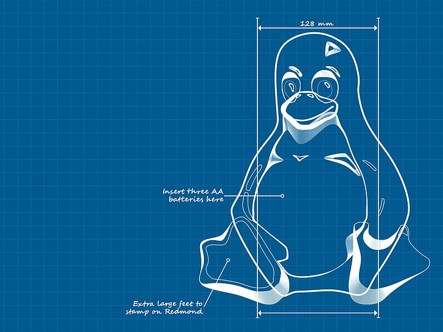

# lfs-home
My LFS (Linux From Scratch) project for Home Workstation

What main purpose of this project?
1. Providing stable environment for next programming languages:
 - python
 - js
 -c/c++
 - java
 - go
2. Providing opportunity for local CI/CD based on:
 - gitlab
 - jenkins
 - kubernetes
 - docker
3. Providing opportunity for automation for VMs and containers
4. Providing logging and monitoring
5. Providing stable work with media-files
6. Providing stable work with cloud-based apps

